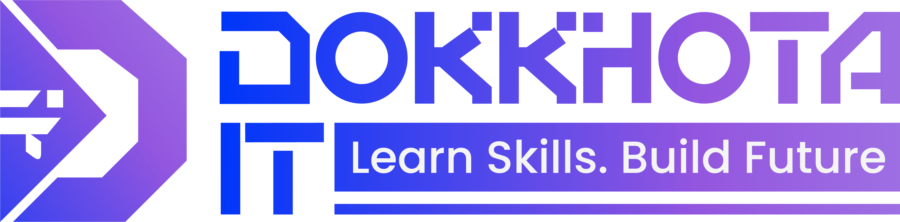

<div align="center">
  
</div>

# Dokkhota IT - Skill Development Platform

Dokkhota IT is a modern, high-performance Learning Management System (LMS) designed to bridge the gap between education and industry. Built with a focus on premium user experience and scalability, it offers expert-led courses in Web Development, Cybersecurity, and AI.

[](https://skillsyncbd-frontend.vercel.app)
[](https://nextjs.org)
[](https://supabase.com)

## 🚀 Key Features

- **Dynamic Course Discovery:** High-fidelity course listings with advanced filtering and real-time search.
- **Premium Course Detail Pages:** Integrated instructor profiles, interactive curriculum, and sleek project showcases.
- **Robust Instructor Ecosystem:** Rich, compact instructor cards with glassmorphism effects and deep-profile integration.
- **Seamless Enrollment:** Optimized checkout flows with coupon support and lead generation.
- **State-of-the-Art Animations:** Powered by `framer-motion` for fluid, professional interactions.
- **Full-Stack Integration:** Real-time data synchronization with Supabase backend.

## 🛠️ Tech Stack

- **Core Framework:** [Next.js 15 (App Router)](https://nextjs.org/)
- **Styling:** [Tailwind CSS](https://tailwindcss.com/)
- **State & Logic:** React Hooks, TypeScript
- **Database & Auth:** [Supabase](https://supabase.com/)
- **Animations:** [Framer Motion](https://www.framer.com/motion/)
- **Package Manager:** [Bun](https://bun.sh/)

## 📦 Getting Started

### Prerequisites

- [Bun](https://bun.sh/) installed on your machine.
- A Supabase project with necessary environment variables.

### Installation

1. Clone the repository:
   ```bash
   git clone https://github.com/shuvogit/Learning-Management-System-.git
   ```

2. Install dependencies:
   ```bash
   bun install
   ```

3. Setup environment variables:
   Create a `.env.local` file with:
   ```env
   NEXT_PUBLIC_SUPABASE_URL=your_url
   NEXT_PUBLIC_SUPABASE_ANON_KEY=your_key
   ```

4. Run the development server:
   ```bash
   bun dev
   ```

## 🌐 Deployment

The project is optimized for deployment on **Vercel**. Automated builds are triggered on every push to the `main` branch.

To deploy manually:
```bash
vercel --prod
```

---

<div align="center">
  
  <p>© 2026 Dokkhota IT. All rights reserved.</p>
</div>
